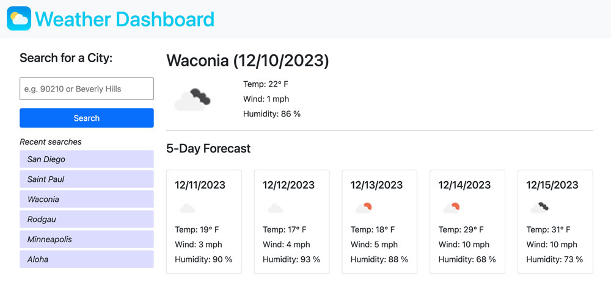

# Weather Dashboard

Using the OpenWeather API, this app enables users to search by either a zip code or a city name to get the current weather and a 5-day forecast.

## The Challenges

This app brought together several stacks in a way that was very fulfilling and educational for me. Using bootstrap, I was able to style the elements quickly and cleanly. Using JQuery, I moved through the JavaScript functions logically with code that is straightforward and easy to read. And finally, using the fetch function on multiple API searches, I could extend the basic app requirements into searching by either zip code or city name.

Setting and getting the local storage was a challenging piece to this app puzzle, but in the end the user experience is lovely and worth the time spent on getting it right.

The Weather Dashboard can be viewed here: [Weather Dashboard](https://vikboyechko.github.io/weather-dashboard)